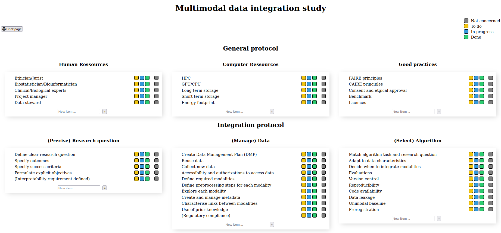

# M4DI

<p align="center">



</p>


Ongoing work!

This repository contains files for one of the figures from the ongoing consortium paper. 
The idea is to provide a self-assessment questions and guidelines to researcher which want to perform integrative analysis.
The HTML file contains tickboxes to make informed decisions. It possible to add additional tickboxes depending of the needs.

### HOW TO USE IT

``` bash
git clone https://github.com/BAUDOTlab/M4DI/
```
Open the HTML.html file and add tickboxes if necessay. 

To save it into pdf, click on "Print page" button on the top left. 
You can add new item on each section if you want.
And then, remove it if it's necessary. The initial items are not deletable but you can check the "not concerned" box in grey. 

### TO DO
- [x] Check the removing event (list are removed if enter on keybord)
- [x] Save the edited file - Possible but CSS is missing ...
- [ ] Find a way to not edit CSS path inside the HTML file (save into cookies is bad idea)
- [ ] Change name files
- [x] ~Make github page to have a printed version~ - Add a printer button to save into PDF
- [ ] Check the initial list of each section
- [ ] Check sections
- [ ] Custom titles

